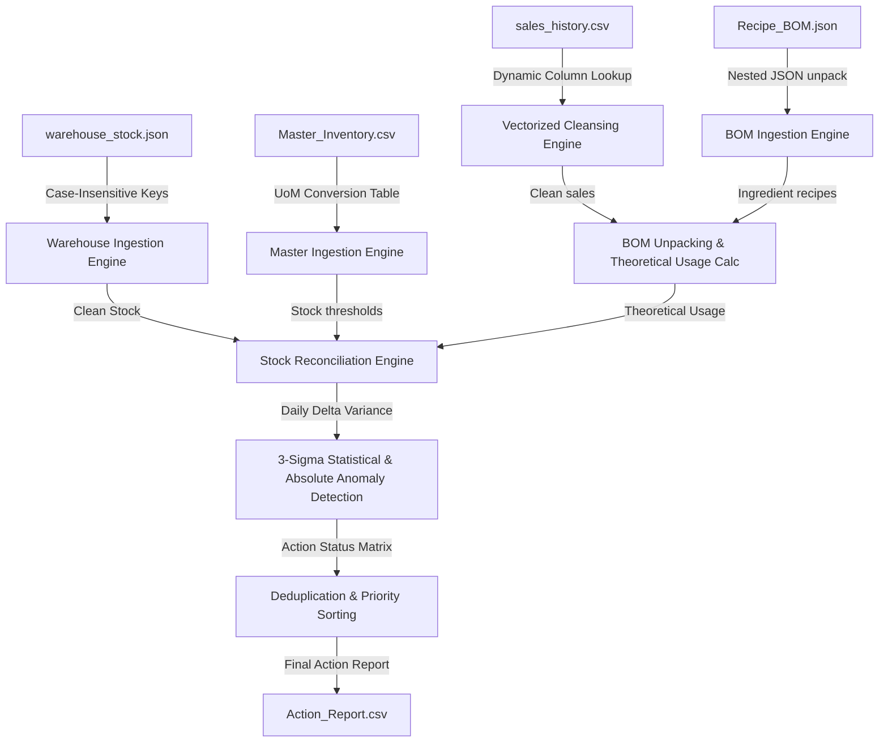

# Rencana Kerja & Panduan Arsitektur ETL Pipeline (Kopikita Roastery)
## Dokumen Perencanaan Integrasi Data & Ketahanan Stress Testing (Zero-Fault Policy)

---

## 📌 1. Pendahuluan & Sasaran Sistem

Sistem ini didesain untuk menjadi sebuah **Automated Data Pipeline (ETL)** tanpa campur tangan manusia (**Zero Human Intervention**) guna memecahkan masalah perbedaan penyimpanan data (*data silos*), perbedaan satuan ukuran (*UoM mismatch*), serta mendeteksi kebocoran finansial (*shrinkage/theft*) pada rantai pasok Kopikita Roastery.

 Skenario data meliputi:
*   Data Kasir (POS): CSV (satuan porsi/cup).
*   Data Gudang: JSON (satuan metrik gram/ml).
*   Data Pembelian: Master CSV (satuan supplier besar kg/liter).

---

## 📌 2. Arsitektur Aliran Data (Data Flow Diagram)

Diagram di bawah ini menggambarkan alur data dari ingesti data mentah hingga penyimpanan laporan keputusan akhir:

### Mekanisme Ingestion & Pembersihan (Checkpoint 1)
1. **Dynamic File Resolver**: Mendeteksi letak berkas dataset secara dinamis menggunakan regular expression (regex pattern matching) sehingga toleran terhadap perubahan akhiran nama file.
2. **Standardisasi Kolom (Schema Drift)**: Helper `standardize_columns(df, alias_map)` memetakan nama header kolom secara dinamis dan case-insensitive.
3. **Helper Parsing JSON**: Helper `get_case_insensitive_key(dict, aliases)` memecahkan masalah schema drift pada key JSON (seperti `stock_remaining` vs `sisa_stok_akhir`).
4. **Vectorized Cleansing**: Memanfaatkan operasi Pandas ter-vektor untuk memproses jutaan baris tanggal, string, dan angka kuantitas secara paralel (kinerja ~2.5 detik untuk 170k baris).

---

## 📌 3. Logika Konversi Satuan & Rekonsiliasi (Checkpoint 2)

### A. Tabel Konversi Satuan Pengukuran (UoM)
Berdasarkan dokumen teknis, berikut adalah pemetaan faktor konversi dari Satuan Supplier besar ke Satuan Base Gudang terkecil yang diterapkan di sistem:

| Satuan Supplier (UoM) | Satuan Base Gudang | Faktor Pengali |
| :--- | :--- | :---: |
| Kilogram / kg / g / gram | gram | `1000` (jika kg) / `1` (g) |
| Liter / l / ml / milliliter | mililiter | `1000` (jika L) / `1` (ml) |
| Galon / gallon / US Gallon | mililiter | `3785` |
| Karton / carton / ctn / box / ctn | pcs | `1000` (estimasi industri HORECA) |
| pcs / piece / pc / unit | pcs | `1` |

### B. Rumus Perhitungan Rekonsiliasi
1.  **Pemakaian Teoritis (BOM Unpacking)**:
    $$\text{Theoretical Usage}(d, \text{Item\_ID}) = \sum \left( \text{Qty Terjual}(d, \text{Menu\_ID}) \times \text{Takaran Resep}(\text{Menu\_ID}, \text{Item\_ID}) \right)$$
2.  **Penurunan Stok Aktual di Gudang**:
    $$\text{Stock Decreased}(d, \text{Item\_ID}) = \text{Stok Akhir}(d-1, \text{Item\_ID}) + \text{Barang Masuk}(d, \text{Item\_ID}) - \text{Stok Akhir}(d, \text{Item\_ID})$$
3.  **Selisih Harian (Delta / Variance)**:
    $$\Delta(d, \text{Item\_ID}) = \text{Stock Decreased}(d, \text{Item\_ID}) - \text{Theoretical Usage}(d, \text{Item\_ID})$$

*Catatan: Logika rekonsiliasi secara otomatis mengecualikan hari pertama ($d=1$) per item inventaris karena tidak memiliki sisa stok hari sebelumnya.*

---

## 📌 4. Logika Deteksi Anomali & Output (Checkpoint 3)

### A. Deteksi Anomali Statistik (3-Sigma Rule)
Untuk membedakan penyusutan wajar (seperti bahan tumpah) dengan kehilangan tak wajar (pencurian/fraud), program menghitung batas toleransi dinamis per bahan baku menggunakan data historis:
*   Batas Atas: $\text{Threshold Upper} = \mu_{\Delta} + 3 \times \sigma_{\Delta}$
*   Batas Bawah: $\text{Threshold Lower} = \mu_{\Delta} - 3 \times \sigma_{\Delta}$

*Safeguard*:
1.  **Floor Limit**: Standar deviasi ($\sigma$) dibatasi minimal `10.0` unit untuk menghindari alarm palsu pada bahan baku berselisih sangat stabil.
2.  **Count Safeguard**: Jika titik data historis kurang dari 3 hari, sistem menggunakan deviasi default aman (`500.0`).

Aturan Klasifikasi Anomali per Baris:
$$\text{Status} = \text{"Anomaly"} \iff \Delta > 1000 \quad \text{atau} \quad \Delta > \text{Threshold Upper} \quad \text{atau} \quad \Delta < \text{Threshold Lower}$$

### B. Aturan Prioritas & Deduplikasi Status
Dalam satu hari per bahan baku, hanya ada satu status keputusan akhir yang diekspor ke `Action_Report.csv`. Jika terjadi tabrakan status ganda, sistem mengurutkannya berdasarkan skala prioritas keparahan:
1.  **Invalid Data**: Menu tidak terdaftar di BOM/katalog.
2.  **Anomaly**: Selisih gudang vs kasir di luar batas toleransi.
3.  **Restock**: Stok fisik akhir hari di bawah ambang batas minimum.
4.  **Safe**: Kondisi operasional normal.

---

## 📌 5. Pemetaan Anotasi Kode Wajib di `main.py`

Sesuai ketentuan, kode sumber di berkas [main.py](file:///d:/hackathon-techprint/main.py) telah dilengkapi anotasi penjelas berukuran besar pada blok utama berikut:

| Anotasi Wajib | Lokasi Baris/Blok Utama | Fungsi Teknis |
| :--- | :--- | :--- |
| **A. Data Ingestion** | Baris **143** s/d **592** | Memuat berkas Master, BOM, Employee, Gudang, & Sales secara asinkron. |
| **B. Data Cleansing** | Baris **500** s/d **537** | Pembersihan noise kolom, pemulihan string numerik, & karantina sales kotor. |
| **C. Calculation** | Baris **602** s/d **720** | Mengurai penjualan POS (BOM) & menghitung sisa pengurangan stok fisik gudang harian. |
| **D. Anomaly Logic** | Baris **723** s/d **867** | Perhitungan 3-sigma, klasifikasi anomali, restock, & penentuan prioritas status. |
