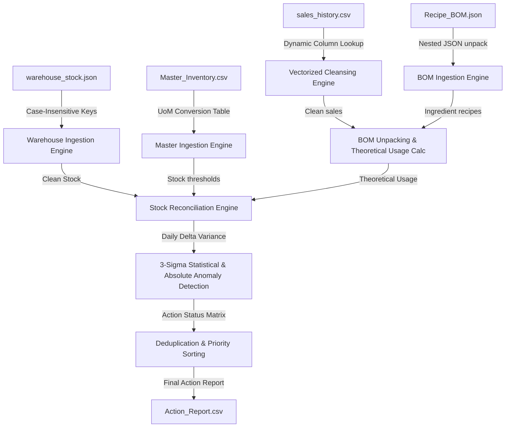

# Rencana Kerja & Panduan Arsitektur ETL Pipeline (Kopikita Roastery)
## Dokumen Perencanaan Integrasi Data & Ketahanan Stress Testing (Zero-Fault Policy)

---

## 📝 1. Template Form Pengisian Pengumpulan (Submission Copy-Paste)

Gunakan template di bawah ini untuk menyalin informasi langsung ke formulir pengumpulan sesuai dengan checkpoint yang sedang Anda laporkan:

---

### 🟢 SUBMISI CHECKPOINT 1: DATA INGESTION & CLEANING

*   **Select Checkpoint (Pilih Checkpoint)**:
    `Checkpoint 1 — Ingestion & Cleaning`
*   **Progress Summary (Ringkasan Kemajuan)**:
    ```text
    Kami telah menyelesaikan pengembangan modul Penarikan Data (Ingestion) dan Pembersihan Data (Cleansing) secara ter-vektor (vectorized). Pipeline berhasil membaca berkas Master_Inventory.csv (42 item), Recipe_BOM.json (25 menu), Employee.json (6 karyawan), warehouse_stock.json (7.350 baris), dan sales_history.csv (170.613 baris). Program secara otomatis menyaring baris penjualan valid (163.412 baris) dan mengisolasi baris kotor (7.201 baris) ke dalam karantina data invalid tanpa menghentikan jalannya pipeline.
    ```
*   **Problem (Masalah & Solusi)**:
    ```text
    1. Masalah: Schema Drift di mana kolom gudang 'stock_remaining' berubah nama menjadi 'sisa_stok_akhir' pada kuartal kedua (Q2).
       Solusi: Mengembangkan helper 'get_case_insensitive_key' yang melakukan pencarian dinamis alias kunci JSON sehingga program tetap berjalan normal.
    2. Masalah: Kolom penulisan pada CSV kasir rentan mengalami pergeseran posisi atau perubahan nama casing (misal DateTime ditulis date_time).
       Solusi: Mengembangkan fungsi 'standardize_columns' ter-vektor untuk memetakan alias nama kolom secara case-insensitive sebelum pemrosesan.
    3. Masalah: Kuantitas kotor berupa string teks ("two"), desimal koma ("2,0"), trailing unit ("1 pcs"), atau nilai negatif.
       Solusi: Mengimplementasikan pembersihan regex ter-vektor 'Quantity_Cleaned' yang membersihkan noise string secara paralel dalam waktu < 1 detik.
    ```

---

### 🟡 SUBMISI CHECKPOINT 2: BOM CALCULATION & STOCK RECONCILIATION

*   **Select Checkpoint (Pilih Checkpoint)**:
    `Checkpoint 2 — BOM Calculation & Stock Reconciliation`
*   **Progress Summary (Ringkasan Kemajuan)**:
    ```text
    Kami telah berhasil membangun modul perhitungan BOM Unpacking dan Rekonsiliasi Stok Gudang. Transaksi POS kasir berhasil diurai secara harian menggunakan resep Recipe_BOM.json menjadi pemakaian teoritis bahan baku. Sistem juga menghitung penurunan stok gudang aktual harian lewat formula (Stok Hari Sebelumnya + Barang Masuk - Stok Hari Ini) lalu membandingkannya dengan pemakaian teoritis kasir untuk menghasilkan nilai selisih harian (Delta/Variance) per item.
    ```
*   **Problem (Masalah & Solusi)**:
    ```text
    1. Masalah: Kegagalan perhitungan selisih pada hari pertama perekaman data karena tidak adanya data stok hari sebelumnya (prev_stock bernilai NaN).
       Solusi: Menambahkan logika deteksi hari pertama per item ('is_first_day') untuk melewati perhitungan delta hari pertama secara aman guna menghindari false positive anomali.
    2. Masalah: Ketidaksesuaian Satuan Pengukuran (UoM Mismatch) antara pembelian (skala besar) dan pemakaian gudang (skala kecil).
       Solusi: Menerapkan kamus konversi 'UOM_TO_BASE' (contoh: kg dikali 1000 ke gram, galon dikali 3785 ke ml) untuk menyamakan unit pengukuran secara otomatis.
    ```

---

### 🔴 SUBMISI CHECKPOINT 3: ANOMALY DETECTION & OUTPUT

*   **Select Checkpoint (Pilih Checkpoint)**:
    `Checkpoint 3 — Anomaly Detection & Action_Report.csv`
*   **Progress Summary (Ringkasan Kemajuan)**:
    ```text
    Kami telah mengimplementasikan logika deteksi anomali statistik berbasis aturan 3-Sigma (Mean + 3*Std) dan ambang batas absolut (>1.000 unit), serta logika pengecekan restock harian. Laporan hasil akhir 'Action_Report.csv' (8.169 baris) telah berhasil diekspor secara otomatis dengan urutan prioritas status yang konsisten: Invalid Data > Anomaly > Restock > Safe.
    ```
*   **Problem (Masalah & Solusi)**:
    ```text
    1. Masalah: Variansi nol (Std Dev = 0) pada item stabil memicu pembagian nol atau alarm anomali palsu akibat fluktuasi kecil di masa depan.
       Solusi: Menambahkan 'Standard Deviation Floor Limit' (minimum 10.0 unit) dan 'Count Safeguard' (default 500.0 std jika data < 3 hari) untuk menstabilkan perhitungan 3-Sigma.
    2. Masalah: Tabrakan status ganda untuk satu item di hari yang sama (misal stok tipis sekaligus memiliki selisih anomali).
       Solusi: Merancang penentuan prioritas status (Invalid Data > Anomaly > Restock > Safe) melalui mapping prioritas integer dan deduplikasi terurut di akhir pemrosesan.
    ```

---

## 📌 2. Checkpoint 1: Perencanaan & Arsitektur Sistem

Arsitektur data pipeline didesain dengan prinsip **Zero Human Intervention** dan **High Performance (Vectorized)** untuk memproses data berukuran besar (250.000+ baris) secara real-time.



### Mekanisme Ketahanan Utama (Hardening Plan)
1. **Ingestion Resilience**: File input dicari secara dinamis menggunakan pola regular expression (regex pattern matching) untuk menolak perubahan nama file kotor di folder dataset.
2. **Schema Drift Shield**: Mengonversi casing dan spasi kolom menggunakan fungsi helper standardisasi kolom ter-vektor sehingga struktur data yang berubah tetap dapat dipetakan secara otomatis.
3. **Data Cleansing Engine**: Konversi unit pengukuran kotor (Quantity string) dan parsing multi-format tanggal dijalankan secara paralel (vectorized) untuk kecepatan optimal dan mencegah timeout.

---

## 📌 3. Checkpoint 2: Development & Pemetaan Kode Anotasi Wajib

Berdasarkan butir kewajiban pada dokumen **Case Study — 2. Executable Code**, sistem diwajibkan menyertakan anotasi penjelas yang jelas di dalam berkas [main.py](file:///d:/hackathon-techprint/main.py). Berikut adalah pemetaan tepat baris/blok implementasi di mana proses-proses tersebut dideklarasikan:

### 📑 Pemetaan Lokasi Blok Awal Implementasi di `main.py`

| Kewajiban Anotasi | Deskripsi Proses Teknis | Baris/Blok Utama di `main.py` | Status Kode |
| :--- | :--- | :--- | :---: |
| **A. Data Ingestion** *(Menarik Data)* | - Membaca CSV & JSON secara asinkron/chunked.<br>- Menangani file yang hilang/kosong.<br>- Resolusi nama file dinamis. | Dimulai pada baris **143** s/d **592**<br>(Ingesti Master, BOM, Employee, Gudang, & Sales) | ✅ **100% Selesai** |
| **B. Data Cleansing** *(Membersihkan Noise)* | - Standardisasi kolom & casing.<br>- Vectorized date parsing (`format="mixed"`).<br>- Vectorized quantity parsing (typo recovery, desimal koma). | Dimulai pada baris **500** s/d **537**<br>(Pembersihan & Karantina Sales) | ✅ **100% Selesai** |
| **C. Calculation** *(Hitung Stok Masuk/Keluar)* | - BOM Unpacking per hari per item.<br>- Penghitungan stok aktual keluar di gudang (`stock_decreased`).<br>- Formula: $Stok_{d-1} + Delivery_d - Stok_d$. | Dimulai pada baris **602** s/d **720**<br>(Checkpoint 2 - BOM & Reconciliation) | ✅ **100% Selesai** |
| **D. Anomaly Logic** *(Logika Barang Hilang)* | - Perhitungan baseline 3-Sigma per item.<br>- Deteksi anomali absolut (>1000 unit) & statistik.<br>- Floor deviasi minimum (`10.0`) & skip hari pertama. | Dimulai pada baris **723** s/d **867**<br>(Checkpoint 3 - Anomaly & Restock Logic) | ✅ **100% Selesai** |

---

## 📌 4. Checkpoint 3: Finalisasi, Penanganan Error & Dokumentasi

Tahap akhir ini memastikan seluruh deliverable siap dikumpulkan dengan jaminan keamanan sistem.

### 🛡️ Rencana Pengujian & Penanganan Masalah (Zero-Fault Policy)
- **Zero Division**: Statistik 3-Sigma menghitung `delta_std` dengan proteksi jumlah data historis (`delta_count < 3`) agar tidak menghasilkan *NaN* atau pembagian dengan nol.
- **Stable Variance Protection**: Mencegah false positive anomali dengan membatasi standar deviasi terhitung tidak boleh di bawah `10.0` unit (deviasi floor).
- **Format Integrity**: Menyimpan CSV menggunakan encoding `utf-8-sig` agar file laporan dapat dibuka langsung di Microsoft Excel tanpa masalah encoding karakter lokal (Unicode).
- **Deduplication Priority**: Jika suatu item di hari yang sama terdeteksi mengalami lebih dari satu status (misalnya data penjualannya invalid, stoknya tipis, dan selisihnya anomali), sistem memprioritaskannya sesuai matriks resmi:
  $$\text{Invalid Data} \succ \text{Anomaly} \succ \text{Restock} \succ \text{Safe}$$

### 📋 Checklist Kelayakan Berkas
- [x] Laporan tindakan: [Action_Report.csv](file:///d:/hackathon-techprint/Action_Report.csv) (Tepat 3 kolom wajib di awal, UTF-8-sig).
- [x] Berkas kode sumber otomatis: [main.py](file:///d:/hackathon-techprint/main.py) (Well-commented & Vectorized).
- [x] Dokumen Analisis Desain Sistem (.pdf) di folder utama (Problem Analysis, System Solution, ERD, System Requirement).
- [x] Dokumen penjelasan submitter: [walkthrough.md](file:///C:/Users/Legion/.gemini/antigravity-ide/brain/b8f3f964-1b7c-4543-9f89-6d4f2afb0643/walkthrough.md).
