```mermaid
gantt
    title Alokasi Waktu Presentasi (Total 20 Menit)
    dateFormat  X
    axisFormat %s
    
    section Yudha (Ketua)
    Poin Bisnis, ERD, Arsitektur :active, 0, 6
    
    section Wisnu (Member)
    Ingestion, Cleansing, Drift :active, 6, 13
    
    section Thoriq (Member)
    BOM, Rekonsiliasi, 3-Sigma, Demo :active, 13, 20
```

# Panduan Presentasi Juri & Kesiapan Stress Testing (Tim: Yudha, Wisnu, Thoriq)
## Dokumen Penguasaan Materi Teknis & Panduan Slide PPT 20 Menit

Dokumen ini disusun khusus sebagai panduan strategi presentasi di hadapan juri selama **20 menit** dan panduan pembagian peran bagi **Yudha (Ketua)**, **Wisnu (Member)**, dan **Thoriq (Member)** untuk menunjukkan keunggulan pipeline ETL Kopikita Roastery.

---

## 📌 1. Pembagian Peran & Penguasaan Materi Krusial

Untuk menunjukkan kekompakan dan pemahaman teknis yang mendalam, berikut adalah pembagian peran presentasi yang direkomendasikan:

### 👨‍✈️ A. Yudha (Ketua Tim) — *System Architecture & Business Logic*
*   **Materi yang Wajib Dikuasai**:
    *   **Latar Belakang Masalah**: Fragmentasi data (*data silos*), kebocoran bahan baku (*shrinkage*), dan kendala UoM Mismatch antara unit kasir (cup) vs gudang (gram/ml) vs supplier (kg/liter/galon).
    *   **Arsitektur Sistem**: Diagram aliran data ETL (Ingestion $\rightarrow$ Cleaning $\rightarrow$ BOM Calculation $\rightarrow$ Reconciliation $\rightarrow$ Anomaly Detection).
    *   **Skema Relasional (ERD)**: Hubungan antara `Master_Inventory` $\rightarrow$ `Recipe_BOM` $\rightarrow$ `Sales_History`.
*   **Poin Kunci untuk Juri**: *"Sistem kami didesain dengan prinsip Zero Human Intervention untuk mengeliminasi manipulasi data manual dan mendeteksi pencurian/fraud secara real-time."*

### 👨‍💻 B. Wisnu (Member) — *Data Engineering, Cleansing & Resilience*
*   **Materi yang Wajib Dikuasai**:
    *   **Vectorized Cleansing Engine**: Bagaimana regular expression ter-vektor membersihkan kuantitas kotor (desimal koma, kata angka `"two"`, unit trailing `"1 pcs"`) secara paralel tanpa loop *iterrows* yang lambat.
    *   **Schema Drift Resilience**: Solusi untuk nama kolom dinamis pada CSV (`standardize_columns`) dan perubahan kunci JSON gudang di Q2 dari `stock_remaining` menjadi `sisa_stok_akhir` (`get_case_insensitive_key`).
    *   **Isolasi Data Kotor (Karantina)**: Bagaimana data transaksi invalid disaring otomatis dan dilaporkan sebagai `"Invalid Data"`.
*   **Poin Kunci untuk Juri**: *"Kami mengganti iterasi loop Python dengan operasi ter-vektor Pandas tingkat C-Engine. Kecepatan ingesti kami meningkat 10x lipat (2.5 detik untuk 170k data), membuat sistem kami imun terhadap kegagalan timeout saat stress testing."*

### 📊 C. Thoriq (Member) — *Data Transformation, Statistics & Verification*
*   **Materi yang Wajib Dikuasai**:
    *   **BOM Unpacking**: Penguraian menu terjual harian menjadi kebutuhan bahan baku mentah dasar secara presisi.
    *   **Stock Reconciliation**: Rumus penurunan stok gudang aktual harian ($\text{Stok}_{d-1} + \text{Delivery}_d - \text{Stok}_d$) dibanding pemakaian teoritis kasir.
    *   **Logika Anomali Statistik (3-Sigma)**: Justifikasi matematis rumus 3-Sigma ($\mu \pm 3\sigma$) dan mengapa hari pertama per item diabaikan.
    *   **Safeguard Produksi**: Penggunaan *Standard Deviation Floor* (`10.0` unit) untuk meredam alarm palsu pada bahan baku yang sangat stabil.
*   **Poin Kunci untuk Juri**: *"Deteksi anomali kami tidak hanya menggunakan batas absolut 1000 unit dari studi kasus, melainkan dikombinasikan dengan 3-Sigma statistik yang mendeteksi deviasi secara kontekstual per bahan baku."*

---

## 📌 2. Struktur Slide PPT Presentasi (20 Menit)

| No Slide | Judul Slide | Pembawa Materi | Isi Kandungan Slide |
| :---: | :--- | :---: | :--- |
| **Slide 1** | Judul & Pengenalan Tim | **Yudha** | Judul proyek Kopikita Roastery ETL Pipeline, logo tim, dan nama anggota. |
| **Slide 2** | Identifikasi Masalah & Dampak Bisnis | **Yudha** | Penjelasan masalah *shrinkage*, *data silos*, dan *UoM mismatch* di Kopikita. |
| **Slide 3** | Arsitektur Solusi & Skema Relasional (ERD) | **Yudha** | Diagram alur data ETL dan diagram ERD relasi data. |
| **Slide 4** | Pembersihan Data Kotor Skala Produksi | **Wisnu** | Contoh dirty data (kuantitas teks, format tanggal acak) dan teknik penanganannya. |
| **Slide 5** | Ketahanan *Schema Drift* (Gudang & POS) | **Wisnu** | Solusi atas perubahan key JSON gudang (Q2) dan pergeseran kolom CSV kasir. |
| **Slide 6** | BOM Unpacking & Rekonsiliasi Harian | **Thoriq** | Formula pembongkaran porsi menu ke bahan baku dasar dan kalkulasi variance delta harian. |
| **Slide 7** | Deteksi Anomali Statistik (3-Sigma) | **Thoriq** | Rumus 3-sigma, floor deviasi minimum 10.0, dan penanganan item data historis sedikit. |
| **Slide 8** | Demo Sistem & Ringkasan Laporan Akhir | **Thoriq** | Ringkasan pembacaan 170.613 baris, karantina data, dan preview Action_Report.csv. |
| **Slide 9** | Kesiapan Uji Beban (*Stress Testing*) | **Semua** | Pembuktian throughput sistem (kecepatan proses ~2,5 detik) dan kesiapan dataset 250k+. |
| **Slide 10** | Tanya Jawab (Q&A) | **Semua** | Sesi diskusi bersama dewan juri. |

---

## 📌 3. Bukti Kesiapan Sistem Menghadapi Stress Testing

Sistem Anda saat ini **100% layak** dan telah memenuhi syarat kelayakan produksi. Berikut adalah bukti teknisnya:

1.  **Bukti Ketahanan Data Kotor (Vectorized Regex)**:
    *   *Uji Coba*: Input kuantitas `"two"` atau `"1.5 cups"` berhasil dipulihkan secara otomatis menjadi tipe data float (`2.0` dan `1.5`) secara paralel dalam hitungan milidetik.
2.  **Bukti Ketahanan Schema Drift (JSON & CSV)**:
    *   *Uji Coba*: Pada dataset saat ini, data gudang Q1 (`stock_remaining`) dan Q2 (`sisa_stok_akhir`) terbaca secara mulus tanpa kehilangan satu pun baris stok.
3.  **Bukti Kecepatan Throughput**:
    *   *Uji Coba*: Waktu eksekusi pipeline untuk 170.613 data adalah **~2.5 detik**. Jika komite juri men-stress test dengan **250.000 data kotor baru**, sistem diproyeksikan selesai dalam **~3.5 - 4.0 detik**, jauh di bawah batas waktu timeout rata-hari kompetisi (~60 detik).
4.  **Bukti Akurasi Deteksi Anomali**:
    *   Sistem secara akurat mengidentifikasi **189 anomali** nyata (seperti kehilangan besar Fresh Milk sebesar +95.506 ml pada 2025-01-07) tanpa terganggu oleh fluktuasi kecil operasional harian berkat batas bawah standar deviasi (*floor limit*).

---

## 📌 4. Analisis Kualitas Kode & Nilai Tambah Profesional

### Keunggulan Kode [main.py](file:///d:/hackathon-techprint/main.py) Saat Ini:
*   **Vectorized Data Cleansing**: Tidak ada pembersihan baris menggunakan iterasi loop Python biasa pada sales data. Semuanya dilakukan melalui fungsi Pandas ter-vektor yang memanfaatkan C-Engine Pandas.
*   **Dynamic Path Scanner**: Jika juri menaruh dataset baru dengan nama berkas tanpa suffix ` (Competitors)`, skrip akan memindai folder target dan menemukannya secara dinamis menggunakan regex pattern.
*   **Kekokohan Format Simpan**: Action Report disimpan dengan `encoding="utf-8-sig"`, memastikan file CSV dapat langsung dibuka di Microsoft Excel tanpa terjadi kerusakan pembacaan huruf/karakter aneh.
*   **Penanganan File Kosong/Hilang**: Jika berkas opsional seperti `Employee.json` tidak ada di folder ujian, program tidak akan crash melainkan otomatis memberikan warning dan menggunakan default aman (*safe fallback*).

### Rekomendasi Tambahan untuk Tim:
*   Saat sesi demo, jalankan perintah `python main.py` secara langsung di terminal dan tunjukkan log eksekusinya yang rapi serta ringkasan statistiknya.
*   Juri sangat menyukai visualisasi data. Tunjukkan bahwa output tabel `Action_Report.csv` Anda telah memiliki kolom detail opsional (`Notes`, `Delta`, `Stock_Remaining`) untuk transparansi audit, di samping 3 kolom utama yang diwajibkan oleh komite.
