# Panduan Presentasi Juri & Kesiapan Stress Testing (Tim: Yudha, Wisnu, Thoriq)
## Dokumen Penguasaan Materi Teknis & Panduan Slide PPT 20 Menit

---

## 📌 1. Bukti Integrasi 5 Berkas Dataset dalam Kode `main.py`

Untuk menjawab keraguan juri, berikut adalah bukti baris kode konkret di dalam berkas [main.py](file:///d:/hackathon-techprint/main.py) yang membuktikan bahwa **kelima berkas dataset telah terintegrasi 100%** di dalam satu alur pemrosesan terpadu:

1.  **`Master_Inventory.csv` (Terintegrasi di Baris 157–194)**:
    *   Dibaca oleh pandas di blok `[1a]`.
    *   Menghasilkan set `valid_item_ids` yang menjadi filter *Foreign Key* saat membaca data gudang (`warehouse_stock.json`) dan resep BOM.
    *   Menghasilkan `inventory_threshold_map` untuk kalkulasi minimum stok saat pengecekan restock.
2.  **`Recipe_BOM.json` (Terintegrasi di Baris 197–293 & 602–652)**:
    *   Dibaca di blok `[1b]` untuk mengekstrak resep porsi ke bahan baku.
    *   Digunakan sebagai lookup relasional di `[2a]` (BOM Unpacking) untuk memecah transaksi menu penjualan menjadi pemakaian teoritis gram/ml.
3.  **`Employee.json` (Terintegrasi di Baris 297–326)**:
    *   Dibaca di blok `[1c]` untuk menghasilkan set `valid_emp_ids`.
    *   Berfungsi memvalidasi Employee_ID transaksi kasir dan pencatat gudang.
4.  **`warehouse_stock.json` (Terintegrasi di Baris 330–410 & 654–720)**:
    *   Dibaca di blok `[1d]` untuk mengekstrak sisa stok fisik harian.
    *   Stok fisik harian gudang ini direkonsiliasi secara matematis di blok `[2b]`.
5.  **`sales_history.csv` (Terintegrasi di Baris 443–592 & 602–652)**:
    *   Dibaca secara batch ter-vektor di blok `[1e]` untuk menyaring penjualan kotor.
    *   Baris penjualan valid dikirim ke blok `[2a]` untuk dikalikan dengan recipe BOM.

---

## 📌 2. Pembagian Peran & Alokasi Waktu (Total 20 Menit)

```mermaid
gantt
    title Alokasi Waktu Presentasi (Total 20 Menit)
    dateFormat  X
    axisFormat %s
    
    section Yudha (Ketua)
    Poin Bisnis, ERD, Arsitektur :active, 0, 6
    
    section Wisnu (Member)
    Ingestion, Cleansing, Drift :active, 6, 13
    
    section Thoriq (Member)
    BOM, Rekonsiliasi, 3-Sigma, Demo :active, 13, 20
```

---

## 📌 3. Skrip Narasi Bicara Presentasi (Narration Scripts)

Gunakan skrip narasi di bawah ini sebagai acuan materi pembicaraan saat latihan presentasi tim:

### 👨‍✈️ Bagian 1: Yudha (Ketua Tim) — Durasi: Menit 0 s/d 6
**Topik**: Pengenalan, Masalah Bisnis, Arsitektur, & Relasi Data (ERD).

> *"Selamat pagi/siang Dewan Juri yang terhormat. Saya Yudha, selaku ketua tim, bersama rekan saya Wisnu dan Thoriq, hari ini akan mempresentasikan rancangan ETL Data Pipeline otomatis untuk Kopikita Roastery.*
>
> *Masalah utama di Kopikita Roastery adalah tingginya fragmentasi data (data silos). Penjualan dicatat dalam cup di POS, sedangkan gudang mencatat sisa bahan baku dalam gram atau mililiter secara manual. Akibatnya, pemilik tidak pernah tahu sisa stok bahan baku secara real-time dan gagal melacak adanya penyusutan barang misterius atau shrinkage.*
>
> *Solusi yang kami tawarkan adalah pipeline ETL otomatis dengan filosofi **Zero Human Intervention** yang kami bangun menggunakan Python dan Pandas. Aliran data kami berjalan otomatis dari membaca file mentah, melakukan pembersihan data kotor, konversi satuan, rekonsiliasi, hingga mendeteksi anomali secara statistik.*
>
> *Secara skema data, kami merelasikan berkas Master Inventory sebagai poros utama. Setiap transaksi di sales history divalidasi ke katalog menu di Recipe BOM untuk memastikan integritas data, dan stempel pencatat stok gudang dicocokkan ke database Employee terdaftar untuk meminimalkan kecurangan internal. Selanjutnya, materi teknis pembersihan data kotor akan dijelaskan oleh Wisnu."*

---

### 👨‍💻 Bagian 2: Wisnu (Member) — Durasi: Menit 6 s/d 13
**Topik**: Ingesti Data Ter-vektor, Pembersihan Data Kotor, & Penanganan Schema Drift.

> *"Terima kasih Yudha. Juri yang terhormat, tantangan terbesar dalam Data Automation adalah menghadapi kotornya data transaksi riil dan perubahan mendadak pada struktur data atau schema drift.*
>
> *Untuk menjamin sistem kami lolos stress testing dengan volume data jutaan baris, kami mengeliminasi loop baris-per-baris Python biasa yang terkenal lambat. Kami mendesain **Vectorized Ingestion Engine** dengan membaca data secara batch per 50.000 baris. Seluruh pembersihan dikerjakan secara paralel di memori.*
>
> *Dalam sales history, kuantitas penjualan sangat berantakan. Kami membersihkannya menggunakan regex ter-vektor: kata angka seperti 'two' otomatis diterjemahkan menjadi 2.0, desimal koma diganti menjadi titik desimal, dan unit trailing seperti 'pcs' atau 'cups' dipotong otomatis. Hasilnya, 170.000+ baris data berhasil kami ingest dan bersihkan hanya dalam waktu **2,5 detik**.*
>
> *Kami juga mengantisipasi **Schema Drift** tingkat produksi secara profesional. Ketika file warehouse mengalami perubahan nama kunci dari 'stock_remaining' menjadi 'sisa_stok_akhir' pada kuartal kedua, program kami tidak crash. Kami membuat fungsi pencarian dinamis yang secara otomatis mendeteksi alias kunci dan menyelaraskan kolom CSV kasir yang bergeser atau berbeda casing-nya secara otomatis. Selanjutnya, kalkulasi BOM dan anomali akan dijabarkan oleh Thoriq."*

---

### 📊 Bagian 3: Thoriq (Member) — Durasi: Menit 13 s/d 20
**Topik**: BOM Unpacking, Rekonsiliasi Delta, Logika Anomali 3-Sigma, & Laporan Akhir.

> *"Terima kasih Wisnu. Juri yang terhormat, setelah data berhasil diingesti dan dibersihkan, sistem kami masuk ke tahap **BOM Unpacking**.*
>
> *Setiap transaksi menu kasir dibongkar berdasarkan gramasi resep di Recipe BOM menjadi pemakaian teoritis bahan baku. Setelah itu, kami menghitung penurunan stok fisik riil di gudang hari demi hari. Selisih dari penurunan stok gudang aktual dikurangi pemakaian teoritis kasir menghasilkan nilai Delta atau Variance.*
>
> *Untuk membedakan penyusutan wajar operasional (seperti bahan tumpah) dengan kehilangan akibat pencurian, kami menerapkan **Statistical Anomaly Detection berbasis aturan 3-Sigma** ($\mu \pm 3\sigma$). Kami juga menambahkan 'Standard Deviation Floor Limit' minimal 10.0 unit untuk mencegah alarm palsu pada bahan baku yang sangat stabil.*
>
> *Hari pertama per item kami abaikan secara logis karena tidak memiliki sisa stok hari sebelumnya. Klasifikasi keputusan akhir kami urutkan berdasarkan prioritas keparahan: Invalid Data jika menu tidak dikenal, Anomaly jika selisih > 1000 unit atau di luar 3-Sigma, Restock jika stok di bawah threshold minimum, dan Safe jika normal. Hasil laporan akhir tersimpan secara rapi dalam berkas **Action_Report.csv**.*
>
> *Sebagai penutup, sistem kami telah lolos uji konsistensi hasil, aman dari division-by-zero, dan 100% siap menghadapi stress testing dataset juri yang jauh lebih besar dan kotor secara mandiri."*

---

## 📌 4. Struktur Slide PPT Presentasi

| No Slide | Judul Slide | Pembawa Materi | Isi Kandungan Slide |
| :---: | :--- | :---: | :--- |
| **Slide 1** | Judul & Pengenalan Tim | **Yudha** | Judul proyek Kopikita Roastery ETL Pipeline, logo tim, dan nama anggota. |
| **Slide 2** | Identifikasi Masalah & Dampak Bisnis | **Yudha** | Penjelasan masalah *shrinkage*, *data silos*, dan *UoM mismatch* di Kopikita. |
| **Slide 3** | Arsitektur Solusi & Skema Relasional (ERD) | **Yudha** | Diagram alur data ETL dan diagram ERD relasi data. |
| **Slide 4** | Pembersihan Data Kotor Skala Produksi | **Wisnu** | Contoh dirty data (kuantitas teks, format tanggal acak) dan teknik penanganannya. |
| **Slide 5** | Ketahanan *Schema Drift* (Gudang & POS) | **Wisnu** | Solusi atas perubahan key JSON gudang (Q2) dan pergeseran kolom CSV kasir. |
| **Slide 6** | BOM Unpacking & Rekonsiliasi Harian | **Thoriq** | Formula pembongkaran porsi menu ke bahan baku dasar dan kalkulasi variance delta harian. |
| **Slide 7** | Deteksi Anomali Statistik (3-Sigma) | **Thoriq** | Rumus 3-sigma, floor deviasi minimum 10.0, dan penanganan item data historis sedikit. |
| **Slide 8** | Demo Sistem & Ringkasan Laporan Akhir | **Thoriq** | Ringkasan pembacaan 170.613 baris, karantina data, dan preview Action_Report.csv. |
| **Slide 9** | Kesiapan Uji Beban (*Stress Testing*) | **Semua** | Pembuktian throughput sistem (kecepatan proses ~2,5 detik) dan kesiapan dataset 250k+. |
| **Slide 10** | Tanya Jawab (Q&A) | **Semua** | Sesi diskusi bersama dewan juri. |
